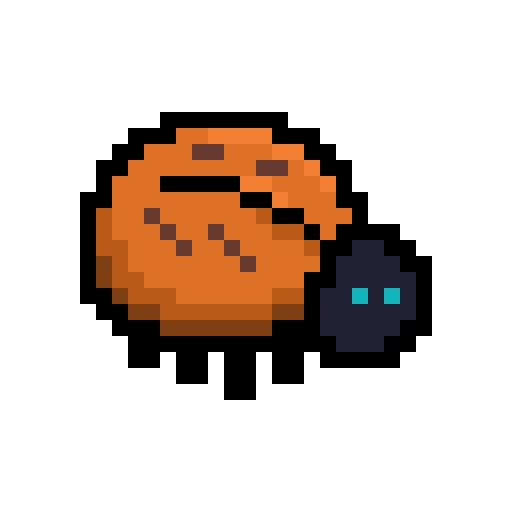

<h1 align="center">
  
  TigerBug
</h1>

<p align="center"><strong>A simple bug tracker built for game developers.</strong></p>

[![Contributors][contributors-shield]][contributors-url]
[![Forks][forks-shield]][forks-url]
[![Stargazers][stars-shield]][stars-url]
[![MIT License][license-shield]][license-url]

## Why we built this

We needed a bug tracker that didn't suck for game development. Most tools are built for web apps and don't handle the stuff we actually need - like sharing save files, crash logs, and screenshots. 

Jira is overkill and expensive. GitHub Issues is too basic. Everything else either costs too much or doesn't understand game development workflows.

So we built our own. It's got the basics done right:

- Project organization (one tracker per game)
- File uploads for screenshots, logs, save files, whatever
- Comments and discussions on issues  
- Voting so you know what actually matters
- Email notifications that don't spam you
- OAuth login (Google, Discord) or just email/password


## How it works

Each bug report has a title, description, priority level, and status. People can comment with attachments, vote on what's important, and discuss solutions. Nothing fancy, just the stuff you actually need.


## Running it

Easiest way is with Docker:

```yaml
services:
  tigerbug:
    image: ghcr.io/twobitgames/tigerbug:latest
    ports:
      - "9840:9840"
    volumes:
      - ./data:/app/server/data
    environment:
      - JWT_SECRET=change-this-to-something-random
      - JWT_EXPIRES_IN=7d
    restart: unless-stopped
```

Then go to http://localhost:9840 and create your admin account.

## Issues and support

We built this for our own use and open-sourced it in case it's useful to others. We don't have time to maintain it as a full project, so there's no Issues tab here.

If you find a critical bug, email us at [contact@twobit-games.com](mailto:contact@twobit-games.com). Otherwise, feel free to fork it and make it work for your needs.

## License

MIT License - see [LICENSE](LICENSE) for details.

---

Built with ❤️ by TwoBit Games

[contributors-shield]: https://img.shields.io/github/contributors/TwoBitGames/TigerBug.svg?style=for-the-badge

[contributors-url]: https://github.com/TwoBitGames/TigerBug/graphs/contributors

[forks-shield]: https://img.shields.io/github/forks/TwoBitGames/TigerBug.svg?style=for-the-badge

[forks-url]: https://github.com/TwoBitGames/TigerBug/network/members

[stars-shield]: https://img.shields.io/github/stars/TwoBitGames/TigerBug.svg?style=for-the-badge

[stars-url]: https://github.com/TwoBitGames/TigerBug/stargazers

[license-shield]: https://img.shields.io/github/license/TwoBitGames/TigerBug.svg?style=for-the-badge

[license-url]: https://github.com/TwoBitGames/TigerBug/blob/master/LICENSE